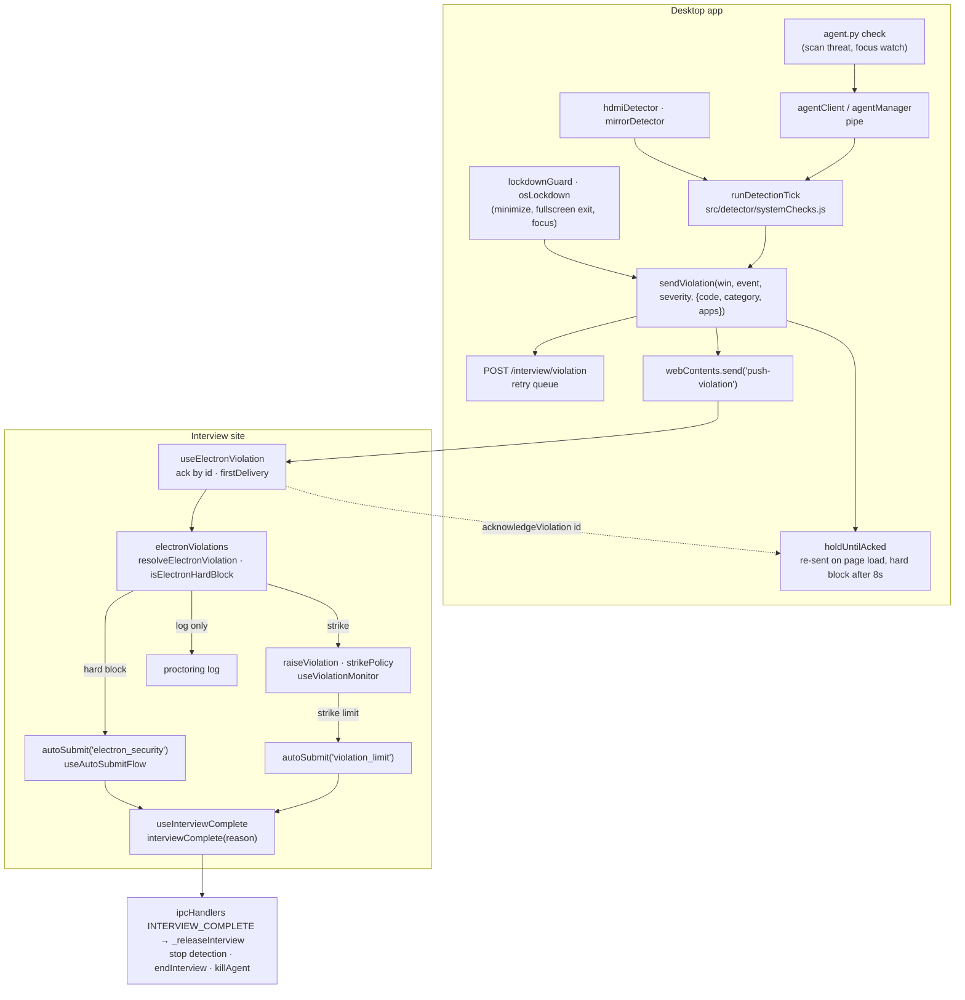

# Architecture

How the desktop app is put together: the processes, the files, the candidate's path through it, and where a violation goes.

- [What it does](#what-it-does)
- [Processes](#processes)
- [Tech stack](#tech-stack)
- [Repository layout](#repository-layout)
- [Application lifecycle](#application-lifecycle)
- [The violation journey](#the-violation-journey)
- [Screen recording](#screen-recording)
- [Backend endpoints](#backend-endpoints)
- [Configuration](#configuration)
- [Security hardening](#security-hardening)

## What it does

1. The candidate **signs in** with email and password (`login.html`), or the app opens straight to the **dashboard** when a saved session is still valid. A `letshyre://` [deep link](web-contract.md#deep-link-protocol) carrying tokens is also supported.
2. From the dashboard, **Take interview** starts the flow: **language selection** (only shown when more than one language is available) → **security check** (`preflight.html`) → **permissions** (camera/mic/screen) → **identity verification** (photo + voice sample) → **role selection** → **interview rules** (the proctoring rules, with the limits the interview site publishes, and Start Interview).
3. The security check blocks the candidate until every check is green: no external displays, no meeting/recording/casting apps, no AI copilot tools, and the deep‑scan agent is running. Blocked apps can be closed from the page itself.
4. On the pages after the security check, the [flow guard](detection.md#between-the-security-check-and-the-interview) keeps checking the machine and refuses every forward step until it is clear.
5. After Start Interview on the rules page, the window enters **[lockdown](lockdown.md)** and loads the interview web app, which starts the **[screen recording](#screen-recording)**.
6. During the interview, detection runs on a fixed cadence. Any finding is pushed to the web app as a **violation** and reported to the backend.
7. When the interview ends, the web app signals completion, the lockdown is lifted and the recording finishes uploading.

## Processes

```
                    letshyre://…?ac=<token>   (deep link)
                                │
                 ┌──────────────▼───────────────────────────────┐
                 │            ELECTRON MAIN PROCESS              │
                 │                                               │
   main.js ─────▶│ src/main/index.js  (single instance, proto)  │
                 │ src/main/app.js     (lifecycle / onReady)     │
                 │ src/main/windowManager.js (lockdown, CSP)     │
                 │ src/main/ipcHandlers.js   (all ipcMain)       │
                 │ src/main/agentManager.js  (spawn + pipe)      │
                 │ src/detector/systemChecks.js (engine)         │
                 │   ├─ hdmiDetector.js   (Electron screen API)  │
                 │   └─ mirrorDetector.js (process scan)         │
                 └───────┬───────────────────────────┬──────────┘
                         │ preload.js (contextBridge) │ stdin/stdout pipe
                         ▼                            ▼
              ┌──────────────────────┐     ┌────────────────────────┐
              │   RENDERER (window)  │     │  PYTHON AGENT (agent.py)│
              │  local pages (file://│     │  behavioural checks,    │
              │   login → preflight) │     │  Windows lockdown       │
              │  interview web app   │     │  primary: stdio pipe    │
              └──────────────────────┘     │  secondary: HTTP :9999  │
              + interview window (locked)  └────────────────────────┘
              + hidden recorder window (screen/mic → chunked upload)
```

Two cooperating detection tiers:

- **Node tier** (main process): displays and running processes, using native OS APIs.
- **Python agent** (`agent.py`, shipped as `agent.exe`): behavioural deep checks that Node cannot do cheaply (network fingerprinting, loaded‑DLL signatures, window titles/classes, transparent overlays, virtual audio devices, virtual cameras, browser‑automation drivers, a physical‑monitor count, a process‑start watcher), plus the Windows half of the [lockdown](lockdown.md).

## Tech stack

| Area                   | Choice                                                                         |
| ---------------------- | ------------------------------------------------------------------------------ |
| Desktop shell          | **Electron 43** (`contextIsolation`, `sandbox`, no `nodeIntegration`)          |
| Main/renderer language | Node.js **20+** (CommonJS)                                                     |
| Deep‑scan agent        | **Python 3.12** + `psutil`, bundled to a single binary with **PyInstaller**    |
| UI                     | Static HTML + hand‑authored CSS on one shared design system; self‑hosted fonts |
| i18n                   | 19 JSON locale bundles, runtime switcher                                       |
| Tests                  | Node's built‑in test runner (`node --test`), Electron e2e suite, unittest      |
| Packaging              | **electron-builder 26** (NSIS installer on Windows, DMG on macOS)              |
| Auto‑update            | `electron-updater` (GitHub releases)                                           |
| Lint/format            | ESLint 8 + Prettier 3                                                          |

## Repository layout

```
.
├── main.js                     # entry shim → src/main/index.js
├── agent.py                    # Python deep-scan agent (source of resources/agent.exe)
├── preload.js                  # contextBridge: exposes window.electronAPI to all pages
├── preload-recorder.js         # minimal contextBridge for the hidden recorder window
├── contract/
│   └── interview-contract.json # what the app and the interview site promise each other
├── docs/                       # these pages
├── scripts/
│   ├── build_agent.py          # PyInstaller build → resources/agent.exe + agent.build.json
│   ├── check-agent-freshness.js # dist guard: refuses a binary older than agent.py
│   ├── check-env.js            # beforePack hook: refuses to package a dev .env
│   ├── sync-contract.js        # copies the contract into an interview-site checkout
│   ├── verifyRelease.js        # CI: checks a draft release, then publishes it
│   ├── releaseManifest.js      # pure checks used by verifyRelease.js
│   ├── clean.js                # removes build output
│   ├── fetch-fonts.js          # regenerates assets/css/fonts.css and assets/fonts/
│   ├── generate-pseudo-locale.js # QA pseudo-locale into assets/locales-dev/
│   └── sync-locale-provenance.js # stamps _meta provenance into every locale bundle
│
├── src/
│   ├── main/                   # Electron main process
│   │   ├── index.js            # single-instance lock, protocol registration
│   │   ├── app.js              # app lifecycle (onReady, updater, screen capture)
│   │   ├── windowManager.js    # windows, page navigation, CSP, interview window, load retries
│   │   ├── lockdownGuard.js    # applies and holds the interview window's lock for the whole session
│   │   ├── osLockdown.js       # OS-level lockdown: agent keyboard/touchpad/focus on Windows, Spaces/focus on macOS
│   │   ├── displayShields.js   # black windows over every display but the interview's
│   │   ├── startWatchdog.js    # asks the candidate what to do if the site never starts the interview
│   │   ├── flowGuard.js        # keeps checking the machine between the security check and the interview
│   │   ├── ipcHandlers.js      # the only file that registers ipcMain channels
│   │   ├── ipcScope.js         # which caller (local pages vs interview site) each channel trusts
│   │   ├── agentManager.js     # spawn agent, stdin/stdout pipe, ensureAgent()
│   │   ├── authManager.js      # login against the LetsHyre API; tokens live main-process-only
│   │   ├── protocolHandler.js  # letshyre:// parsing → interview URL + token
│   │   ├── blocklistPolicy.js  # optional per-company blocklist policy from the backend
│   │   ├── preflightTelemetry.js # optional anonymous security-check results for the backend
│   │   ├── processKiller.js    # PID-accurate force-kill of blocked apps (services, relaunchers, elevation)
│   │   ├── processTable.js     # pure process-table parsing/matching used by processKiller
│   │   ├── screenRecorder.js   # hidden recorder window + chunked upload pipeline
│   │   ├── pendingUploads.js   # encrypted on-disk store for chunks not yet confirmed by the backend
│   │   ├── spillKey.js         # key for that store, sealed by the OS keystore
│   │   ├── adaptiveBitrate.js  # lowers the recording bitrate while uploads fall behind
│   │   ├── localeManager.js    # resolves/persists candidate UI language
│   │   ├── updater.js          # auto-update orchestration (electron-updater)
│   │   ├── appState.js         # quitting flag
│   │   └── logger.js           # file logger (userData/secure-interview.log)
│   │
│   ├── detector/               # detection logic (runs in main process)
│   │   ├── systemChecks.js     # detection ENGINE: preflight + live tick + violations
│   │   ├── hdmiDetector.js     # external-display detection (Electron screen API)
│   │   ├── mirrorDetector.js   # blocked-process scan (tasklist CSV / ps)
│   │   ├── preflightVerdict.js # maps raw detector output → preflight verdict contract
│   │   └── agentClient.js      # talks to the Python agent (pipe-first, HTTP fallback)
│   │
│   ├── renderer/               # page controllers (sandboxed renderer)
│   │   ├── preflight.js        # security-check screen controller
│   │   ├── preflightModel.js   # pure, DOM-free security-check logic (window.PreflightModel)
│   │   ├── securityGuard.js    # violation modal on the pages after the security check
│   │   ├── login.js            # login screen controller
│   │   ├── dashboard.js        # candidate dashboard controller
│   │   ├── role-selection.js   # role-selection step state machine
│   │   ├── interview-rules.js  # the rules step and Start Interview
│   │   ├── identity-verification.js  # identity-verification screen controller
│   │   ├── permissions.js      # OS permissions screen controller
│   │   ├── language-selection.js # pick the interview language before the security check
│   │   ├── recorder.js         # runs inside the hidden recorder window
│   │   ├── updateCard.js       # auto-update card, loaded by every local page
│   │   ├── rendererUtils.js    # small helpers shared by the page controllers
│   │   ├── stepIndicator.js    # "Step N of M" in the setup pages' top bar
│   │   └── languageSwitcher.js # keyboard-accessible language dropdown widget
│   │
│   └── shared/
│       ├── constants.js        # single source of truth: ports, URLs, IPC names, timings
│       ├── flowSteps.js        # setup step order, shared by the flow guard and the step indicator, locales
│       ├── violationCodes.js   # machine-readable violation codes and which are never hard blocks
│       ├── appList.js          # built-in blocked app lists + friendly display names
│       ├── blocklist.js        # the blocklist in force: appList adjusted by the company policy
│       ├── agentBuild.js       # the agent.py hash this build shipped with
│       └── authValidators.js   # email/password rules (main-side backstop for login.js)
│
├── assets/                     # static UI (HTML/CSS/icons/locales) loaded as file://
│   ├── login.html · dashboard.html · language-selection.html · how-it-works.html
│   ├── preflight.html          # security check (loads src/renderer/preflight.js)
│   ├── permissions.html · identity-verification.html · role-selection.html · interview-rules.html
│   ├── interview-unavailable.html # shown, still locked, while the interview site can't be reached
│   ├── recorder.html           # hidden recorder window
│   ├── css/                    # base.css + components.css (shared design system), per-page sheets
│   ├── fonts/                  # self-hosted Inter + Noto subsets for non-Latin scripts
│   ├── js/i18n.js              # locale loading/translation helper
│   └── locales/                # per-language JSON translation bundles (19 languages)
│
├── test/                       # node:test suites, e2e/ (Electron), test_agent_*.py (unittest)
├── .env.example                # interview/API hosts + DevTools toggle (copy to .env)
└── resources/agent.exe         # built agent binary (gitignored — rebuild before packaging)
```

## Application lifecycle

```
launch ─▶ onReady (src/main/app.js)
   ├─ logger.init, authManager.init       # restore the saved session (OS keystore)
   ├─ pendingUploads.init                 # open the encrypted recording store, purge >7-day-old sessions
   ├─ authManager.verifySession()
   ├─ registerIpcHandlers()
   ├─ applyArgvDeepLink()                 # Windows: read tokens from argv
   ├─ createWindow() → dashboard.html (valid session) | login.html
   ├─ updater.init()                      # check GitHub releases, then every 6h
   └─ resumePendingUploads()              # finish a recording a previous quit/crash interrupted
            │  dashboard: Check my computer → preflight.html?mode=practice (result + Back to dashboard only)
            │  dashboard: Take interview
            ▼
   prewarmAgent()                         # agent boots while the candidate picks a language
   blocklistPolicy                        # optional company policy, fetched once
   language-selection.html (if >1 language) → preflight.html
            │
   SECURITY CHECK (gate)
   ├─ runPreflight → runChecksOnce()      # hdmi + processes + agent deep scan + physical monitors
   ├─ ensureAgent()                       # respawn agent if it died (self-heal on re-scan)
   ├─ close blocked apps from the page    # see detection.md "Closing blocked apps"
   └─ pre-proceed monitor (every 2s)      # keeps the Continue button state live
            │  Continue (main re-verifies the scan passed and is fresh)
            ▼
   permissions.html → identity-verification.html → role-selection.html → interview-rules.html
   └─ flowGuard (every 2s)                # each forward step gated on a fresh check
            │  (each setup page shows "Step N of M", order from src/shared/flowSteps.js)
            │  Start (main re-verifies a scan passed this session)
            ▼
   LOCKDOWN (windowManager.lockdownForInterview → lockdownGuard, osLockdown, displayShields)
   ├─ its own window, built kiosk + fullscreen + always-on-top; the app window hides
   ├─ held for the whole session (re-applied on drift, 1s watchdog)
   ├─ Windows: agent blocks system keys and touchpad gestures, pulls focus back
   ├─ macOS: on every Space, focus taken back when lost
   ├─ other displays covered in black
   ├─ navigation guardrails (only interview origin + file://)
   ├─ startWatchdog: asks the candidate after 3 min if the site never starts
   └─ load interview web app (tokens, photo, role, locale via sessionStorage)
            │
   LIVE MONITOR (systemChecks.start → runDetectionTick at once, then every 5s)
   ├─ external display / duplicate-mirror
   ├─ blocked processes launched mid-interview (also checked the moment the agent sees one start)
   ├─ agent deep-scan threats
   ├─ agent reachability (anti-tamper)
   ├─ display added/removed → immediate tick (debounced 300ms)
   └─ heartbeat to backend (every 30s)
   RECORDING (web app calls startProctoring; chunks upload while recording)
            │  web app signals interviewComplete
            ▼
   END (stop detection, hand back keyboard/touchpad, stop agent, lift lockdown;
        recording stops on stopProctoring)
```

## The violation journey

One finding, from the machine to the end of the interview. Left side is this repo, right side the interview site.



The app never ends the interview on its own. See [decisions/site-owns-enforcement.md](decisions/site-owns-enforcement.md).

## Screen recording

The web app starts and stops recording (`startProctoring()` / `stopProctoring()`). A hidden recorder window (`recorder.html`) captures the screen and mic, and `screenRecorder.js` uploads it **while the interview runs**:

- **Pipeline:** `/start` → upload id, `/chunk` × N during the interview (2 in parallel, retried), `/complete` only once nothing is left queued, then `/status` polling. Registration is retried during the interview rather than after it.
- **Durable:** every chunk is written to `userData/pending-uploads/` **encrypted (AES‑256‑GCM)** before it is queued, and deleted only once the backend confirms it. The key is sealed by the OS keystore; without one it stays in memory, so chunks remain unreadable but can't resume after a restart. Sessions older than 7 days are purged.
- **Adaptive:** the bitrate steps down (1 Mbps → 750 kbps → 500 kbps) while uploads fall behind, and back up once they keep pace.
- **Resumable:** uploads resume when the network returns, and anything left over is finished on the next launch (when the saved session is still valid).
- **Quitting mid‑upload** asks _Finish upload_ (waits up to 5 min) or _Quit anyway_ (resumes next launch).

Recording failures never block the interview; they are reported to the web app via `onProctoringError` (see [web-contract.md](web-contract.md#recording-failures)).

## Backend endpoints

The client calls these on `API_BASE_URL` (from `.env`, no default) with `Authorization: Bearer <accessToken>` (except login/refresh):

| Endpoint                                                                          | When                                                                                                                                                  |
| --------------------------------------------------------------------------------- | ----------------------------------------------------------------------------------------------------------------------------------------------------- |
| `POST /user/v1/login/` · `POST /user/v1/login_refresh/` · `POST /user/v1/logout/` | Sign‑in, token refresh, sign‑out                                                                                                                      |
| `GET /user/v1/candidate_profile/`                                                 | Dashboard; also verifies the saved session at launch                                                                                                  |
| `POST /user/v1/candidate/interview/face_verification/`                            | Identity verification photo                                                                                                                           |
| `POST /user/v1/candidate/interview/voice_sample/`                                 | Identity verification voice sample                                                                                                                    |
| `POST /user/v1/candidate_resume_ai/skills_for_role/`                              | Role selection                                                                                                                                        |
| `POST /user/v1/candidate_interview/video_upload/start/`                           | Register a recording upload                                                                                                                           |
| `POST /user/v1/candidate_interview/video_upload/chunk/`                           | Each recording chunk, during the interview                                                                                                            |
| `POST /user/v1/candidate_interview/video_upload/complete/`                        | After the last chunk is confirmed                                                                                                                     |
| `GET /user/v1/candidate_interview/video_upload/status/<uploadId>/`                | Poll until the backend has merged the video                                                                                                           |
| `POST /interview/heartbeat`                                                       | Every 30s during the interview — `{ timestamp, sessionId, interviewId, appVersion }`                                                                  |
| `POST /interview/violation`                                                       | On every violation (retried, also after a restart) — the [violation payload](#violation-model); dedupe on `id`; a 4xx other than 401/408/429 drops it |

> **Required for enforcement:** `POST /interview/violation` must be implemented server‑side to record/flag/terminate sessions. Until it exists, violation reports are queued and retried client‑side.

Two optional security-check endpoints (blocklist policy and scan telemetry) are described in [detection.md](detection.md#optional-security-check-endpoints).

## Configuration

Most knobs live in `src/shared/constants.js`:

| Constant                                 | Default                                     | Meaning                                              |
| ---------------------------------------- | ------------------------------------------- | ---------------------------------------------------- |
| `INTERVIEW_BASE_URL`                     | — (`INTERVIEW_FRONTEND_BASE_URL` in `.env`) | Web app loaded during the interview                  |
| `API_BASE_URL`                           | — (`API_BASE_URL` in `.env`)                | Backend                                              |
| `DEVTOOLS_ENABLED`                       | off (`DEVTOOLS` in `.env`)                  | Dock DevTools, allow F12 / Ctrl+Shift+I              |
| `DETECTION_INTERVAL_MS`                  | `5000`                                      | Live detection tick cadence                          |
| `VIOLATION_COOLDOWN_MS`                  | `15000`                                     | Min gap between repeats of the same violation        |
| `HEARTBEAT_INTERVAL_MS`                  | `30000`                                     | Backend heartbeat cadence                            |
| `INDETERMINATE_ESCALATION_THRESHOLD`     | `3`                                         | Consecutive unverifiable scans before escalating     |
| `HARD_BLOCK_GRACE_MS`                    | `8000`                                      | Wait for an ack before re‑sending a hard block       |
| `MAX_UNACKED_VIOLATIONS`                 | `20`                                        | Unacknowledged violations kept for redelivery        |
| `GUARD_INTERVAL_MS`                      | `2000`                                      | Flow guard re-check cadence after the security check |
| `PREFLIGHT_RESULT_MAX_AGE_MS`            | `60000`                                     | A security-check pass older than this is re-verified |
| `AGENT_PORT`                             | `9999`                                      | Agent HTTP fallback port                             |
| `UPDATE_CHECK_INTERVAL_MS`               | 6 h                                         | Auto‑update re‑check cadence                         |
| `UPDATE_RETRY_MS` / `UPDATE_MAX_RETRIES` | 5 min / 3                                   | Sooner retries after a failed update check           |
| `SUPPORTED_LOCALES`                      | 19 locales, only `en` reviewed              | Packaged builds offer only `reviewed: true` locales  |

Environment variables: `INTERVIEW_FRONTEND_BASE_URL` / `API_BASE_URL` (required), `DEVTOOLS`, `SUPPORT_URL` / `SUPPORT_EMAIL` (optional help link and address), `PREFLIGHT_POLICY_PATH` / `PREFLIGHT_TELEMETRY_PATH` (optional, see [detection.md](detection.md#optional-security-check-endpoints)), `AGENT_PY` / `AGENT_PY_BIN` (dev agent), `AGENT_LOG_DIR` / `APP_VERSION` / `AGENT_SECRET` (set automatically for the spawned agent), `LOG_LEVEL` (main-process log verbosity, default `info`; see `src/main/logger.js`), `ALLOW_DEV_ENV` (package against local hosts, see [release.md](release.md)).

Both hosts are required and have **no built‑in fallback**. In dev `.env` is read from the repo root; a packaged build reads it from beside the executable, where the release workflow writes it from the `INTERVIEW_FRONTEND_BASE_URL` / `API_BASE_URL` repository variables (the build fails if either is missing). Real environment variables win over `.env`.

## Security hardening

- `contextIsolation: true`, `sandbox: true`, `nodeIntegration: false`; preload whitelists IPC channels (send/invoke/receive).
- Every `ipcMain` channel declares which caller it trusts (`ipcScope.js`): local `file://` pages or the interview origin. The interview site can't reach auth, navigation, kill, update or diagnostics channels.
- Navigation is restricted to the interview origin and `file://`; `window.open` is denied.
- Copy, view‑source, PrintScreen and the context menu are blocked (paste is allowed in form fields). F12 / Ctrl+Shift+I are blocked unless `DEVTOOLS` is on. F11 and Alt+F4 are blocked during interviews.
- The [interview lockdown](lockdown.md) is held for the whole session, not set once.
- Only media capture (local pages and the interview site) plus fullscreen and keyboard lock (interview site only) are granted; everything else is refused (`ipcScope.isPermissionAllowed`).
- Strict CSP on local `file://` pages.
- The agent HTTP fallback requires a per‑launch secret (`X-Agent-Token`) and restricts CORS; the primary pipe is parent‑only.
- `processKiller` can only kill apps on the blocked whitelist (or their registered relaunchers), never itself, its own process tree or the agent. PIDs and service names are validated before they reach a command line, and elevation is refused during an interview.
- Recording chunks are encrypted at rest (AES‑256‑GCM, key sealed by the OS keystore).
- Auth tokens live in the main process only, persisted via the OS keystore.
